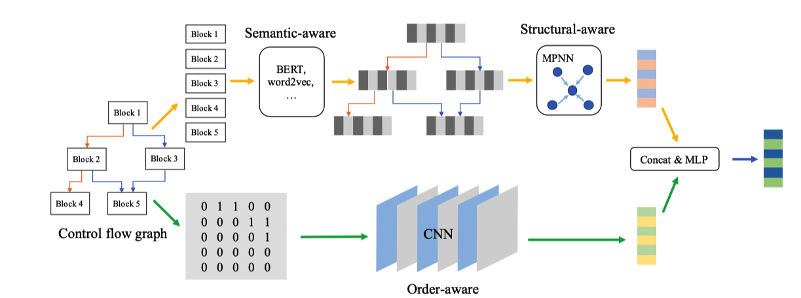
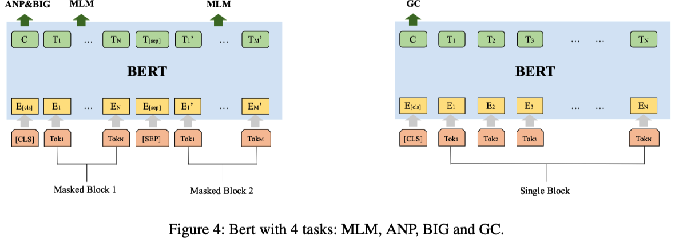

论文原文：《》

> 原文未提供官方代码，本仓库为作者根据论文描述进行复现。

### 整体情况

### 预处理

**作用**：原始数据文件中的cfg种提取出以基本块指令为基本单位的语料库，用于Bert模型训练。

**主要操作**：

- **操作数中地址映射与泛化**（原文未提及）

  - symbol_map中地址映射为地址对应的符号名
  - string_map中地址映射为地址对应的字符串值
  - 其他地址统一泛化为字符串address

- **基本块指令拼接形成基本块指令**：每个基本块中的全部指令以“ ”拼接在一起，每个基本块形成一条基本块指令

- **随机游走**

  > 遍历基本块指令构成的cfg的每个节点，在每个节点随机游走访问其后继节点，直到其没有后继节点或达到**随机游走序列长度上限**，构成一个随机游走序列；如果cfg中节点数量过多，那么当已经形成的遍历的遍历序列达到**生成序列数量上限**则不再对后续节点进行遍历。

- **根据随机游走序列生成bert训练的语料库**

  > - **cfg_train.txt**：对于产生的基本块指令组成的随机游走序列，**每个序列中的两条相邻基本块指令构成一条训练样本**，用于训练BERT中**MLM和NSP任务**
  > - **cfg_grain_append.pkl**：**每个cfg中随机抽取10个基本块指令，并记录使用的 编译选项信息，**构成一条训练样本，用于训练BERT中**BIG和GC任务**
  > - **optimize_Map.pkl**：记录训练集中包含的**编译选项以及每种编译选项对应的索引字典**。

### Block Embedding Model—BERT（4 Task）

**作用**：训练汇编语言的BERT语言模型，将汇编语言BERT用于cfg图编码生成Block Embedding CFG

#### BERT模型训练

**训练任务：**

- **语言模型任务（MLM）**：token-level，输入为mask一些token的基本块指令，然后预测mask的token，学习block内语义信息。
- **块连接节点预测任务（NSP）**：block-level，正样本为一个CFG中相邻的两个基本块指令，负样本为一个CFG中相邻的两个基本块指令中一个随机替换为同一个图中的其他基本块指令，预测两个block是否相邻。
- **块同图任务（BIG）**：block-level，随机选择两个基本块指令，判断是否在一个图中。
- **图分类任务（GC）**：graph-level，输入一个基本块指令，判断基本块指令属于的平台、编译器。

#### 使用BERT进行block embedding

目标：使用训练好的BERT模型对CFG图中每个节点进行Embedding，获得Block embedding cfg用于后续func embedding的训练

实现：

- CFG图中每个基本块中的指令构成以” “为连接符进行拼接
- 

